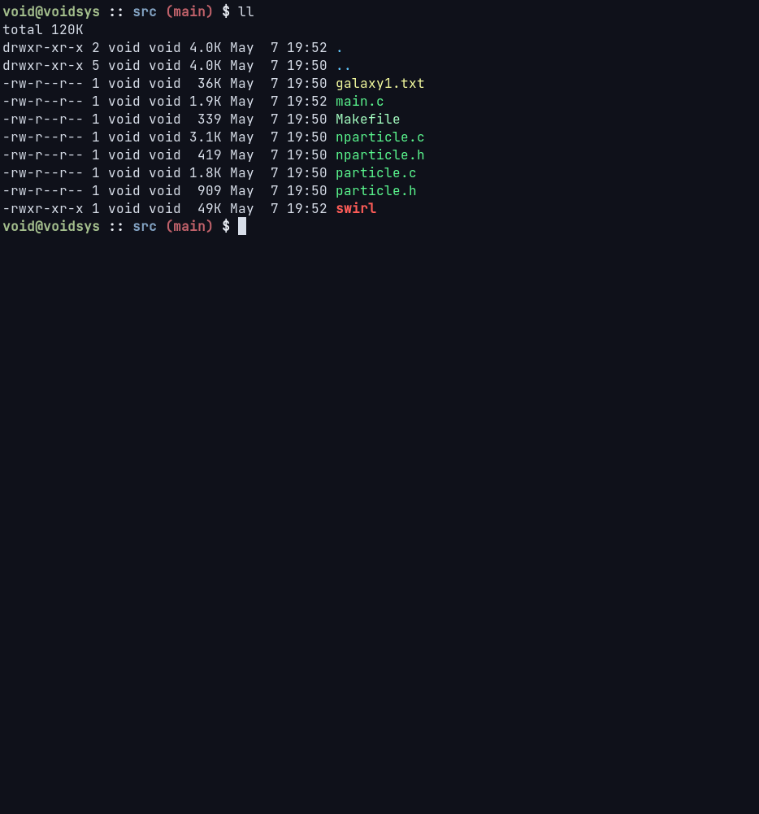

# swirl

## Overview
_swirl_ is just a little toy project to run n-body simulations in the terminal using pixel art for visualization.
This entire project is heaviely based on [nbody-c](https://github.com/iSach/nbody-c) from _iSach_, and mostly was developed to learn more about how n-body simulations work.
An example of how a simulation can look like is shown below:

## Implementation & Ideas

Currently, swirl only uses the trivial (inefficient) approach to compute n-body simulations. I might add a barnes-hat implementation in the future, for more efficient simulations.

I've also started working on a galaxy simulator, however, it is currenly not functional. The demo just utilizes the input file, from the _nbody-c_ project.

## Dependencies

Currently, the following dependencies are required to build the project:

- [dotdotdot](https://github.com/766F6964/dotdotdot): A graphics library, developed by me, that allows to render to the terminal using braille characters
- [log](https://github.com/766F6964/log): A small logging library, developed by me.
